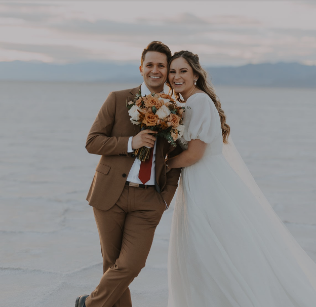

# Customizable Wedding Website (customizable-wedding)
I am going to create a website that is a customizable resource for newly engaged couples who are planning a wedding.  It will handle RSVPs, have registry links, and allow the couple to add their own photos and addresses for venues.  All the user will need to do is create an account and fill in some fields and photos and they will be able to reference the RSVP list. 

# Domain Driven Design
## Events
- User Logged in 
- User logged out
- User account created
- User account deleted
- Photo uploaded
- Couple_name updated
- Address updated
- Registry link added
- Registry link deleted
- Guest added to list
- Guest deleted from list

# #Commands
- Create user account
- Delete user account
- Login user
- Logout user
- Upload photo
- Update Couple_name
- Update Address
- Create registry link
- Delete registry link
- Add guest to list
- Delete guest from list

## Entities
**Account**
- User id (unique and defined by user)
- Name (What the user would like to be called)
- Password (encrypted passwords)
- Session info (info about whether they are logged in)

**Form**
- Couple's names (The names to be displayed on the main page; not unique)
- Couple photo 1 (Photo to be displayed behind couple's name)
- Address 1 (The name and location of the ceremony)
- Venue photo 1 (Photo of the ceremony venue)
- Address 2 (The name and location of the reception)
- Venue photo 2 (Photo of the reception venue)
- Registry link (Name and link to registry)

**Guests**
- Guest's full name (Name of the guest to be added)

## Value Object
**File**
- Data (The data of the files for photo uploads)

# REST Design
| Description | URL Fragment | HTTP Method | Path Parameters | Representations |
| ----------- | ------------ | ----------- | --------------- | --------------- |
| create account | `/accounts` | POST | | Create Account |
| delete account | `/accounts/{accountId}` | DELETE | `accountId` | |
| log in | `/accounts/{accountId}/login` | PUT | `accountId` | Account Log In |
| log out | `/accounts/{accountId}/logout` | PUT | `accountId` | |
| update form | `/forms` | PUT | | Update Form |
| get home | `/home/{username}` | GET | | Get the Home Page |
| add guest to list | `/guests/{accountId}/addGuest` | PUT |  `accountId` `guestId`  | Add Guest to List |
| get guest list | `/guests` | GET | | Get the Guest List |
| delete guest from list | `/guests/{accountId}/deleteGuest` | DELETE | `accountId` `guestId` | |

# Representation

### Account Log in

```json
{
  "username" : "username",
  "password": "a-password"
}
```

### Create Account
```json
{
  "username" : "username",
  "name" : "First Name",
  "password" : "a-password"
}
```

### Add Guest to List
```json
{
  "guestName" : "GuestFullName",
  "email" : "guestEmail"
}
```

### Update Form
```json
{
  "coupleName" : "The Couple's Names",
  "couplePhotoOne" : "Photo of couple",
  "AddressOne" : "Ceremony Name and Address",
  "AddressOnePhoto" : "Photo of ceremony venue",
  "AddressTwo" : "Reception Name and Address",
  "AddressTwoPhoto" : "Photo of Reception venue",
  "couplePhotoTwo" : "Second photo of couple"
  "AddRegistryLink" : "Add a registry link"
}
```
### Get Home
```json
{
  "coupleName" : "The Couple's Names",
  "couplePhotoOne" : "Photo of couple",
  "AddressOne" : "Ceremony Name and Address",
  "AddressOnePhoto" : "Photo of ceremony venue",
  "AddressTwo" : "Reception Name and Address",
  "AddressTwoPhoto" : "Photo of Reception venue",
  "couplePhotoTwo" : "Second photo of couple"
  "AddRegistryLink" : "Add a registry link"
}
```
### Get Guestlist
```json
{
  "guestName" : "GuestFullName",
  "email" : "guestEmail"
}
```

### File

